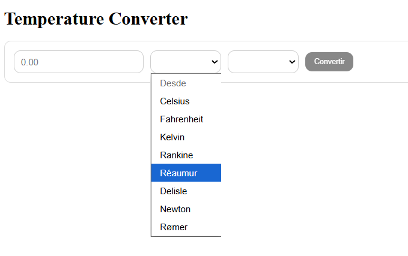

# Conversor de Temperatura (Angular)

Este proyecto es un mini-ejercicio para practicar manipulación del DOM, manejo de formularios y cálculos básicos en Angular (standalone components).



## Objetivo
- Ingresar un valor numérico de temperatura.
- Seleccionar la unidad origen y la unidad destino.
- Habilitar el botón "Convertir" solo cuando los 3 campos son válidos.
- Mostrar el resultado de la conversión debajo del formulario.
- Soportar múltiples escalas de temperatura (modernas e históricas).

## Tecnologías
- Angular 18 (standalone)
- Formularios reactivos (`ReactiveFormsModule`)
- TypeScript 5.5
- SCSS para estilos
- Pruebas unitarias con Jasmine/Karma

## Escalas soportadas
El conversor trabaja con **8 escalas de temperatura**:
- **Celsius (°C)** - Escala métrica estándar
- **Fahrenheit (°F)** - Escala imperial
- **Kelvin (K)** - Escala absoluta científica
- **Rankine (°R)** - Escala absoluta basada en Fahrenheit
- **Réaumur (°Ré)** - Escala histórica europea
- **Delisle (°De)** - Escala invertida histórica
- **Newton (°N)** - Escala de Isaac Newton
- **Rømer (°Rø)** - Escala danesa histórica

## Estructura relevante
- `src/app/features/converter/` Componente de conversión y estilos.
- `src/app/core/temperature.service.ts` Lógica de conversión entre todas las escalas.
- `src/app/app.component.ts` Pinta el conversor como pantalla principal.

## Documentación del proceso (índice)
- `docs/proceso.md` — Paso a paso del desarrollo.
- `docs/arquitectura.md` — Diseño y decisiones de arquitectura.
- `docs/criterios-aceptacion.md` — Qué debe cumplir la app.
- `docs/guia-uso.md` — Cómo utilizar el conversor.
- `docs/pruebas.md` — Pruebas unitarias.
- `docs/pruebas-manuales.md` — Casos manuales sugeridos.
- `docs/accesibilidad.md` — Consideraciones básicas.
- `docs/backlog.md` — Ideas futuras.
- `docs/changelog.md` — Registro de cambios.
- `docs/troubleshooting.md` — Problemas comunes y soluciones.

## Cómo ejecutar
```
npm install
npm start
```
Abrir `http://localhost:4200`.

Más detalles en `docs/arquitectura.md`, `docs/guia-uso.md`, `docs/decisiones.md` y `docs/pruebas.md`.
